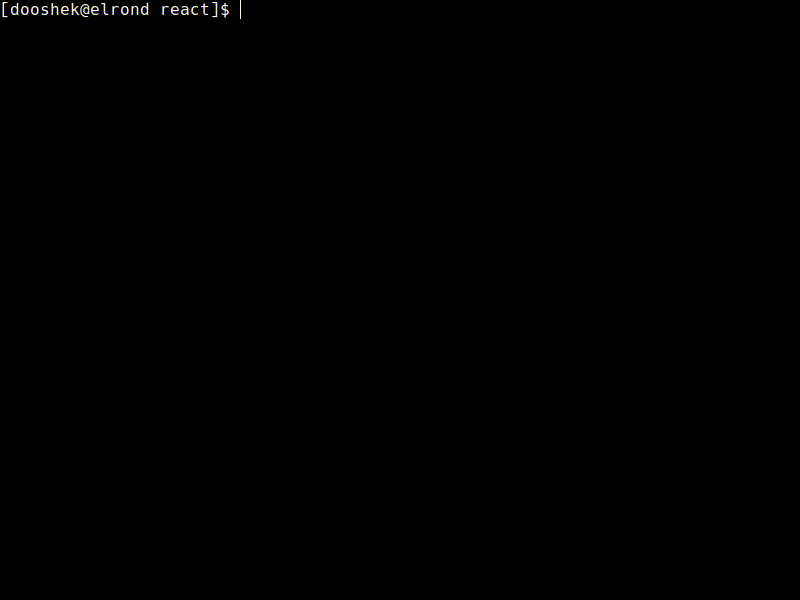

 

**Table of Contents**
<!-- TOC depthfrom:1 -->

- [What's DeKick?](#whats-dekick)
  - [What is our goal?](#what-is-our-goal)
  - [Common problems DeKick can help with:](#common-problems-dekick-can-help-with)
  - [How DeKick helps your team?](#how-dekick-helps-your-team)
  - [System requirements](#system-requirements)
- [How it works?](#how-it-works)
- [Quick start](#quick-start)
- [Usage](#usage)
  - [Running DeKick in **local** environment](#running-dekick-in-local-environment)
    - [Command dekick local](#command-dekick-local)
    - [How to run flavour specific commands like yarn, npm, npx, composer or artisan?](#how-to-run-flavour-specific-commands-like-yarn-npm-npx-composer-or-artisan)
  - [This project is still under development](#this-project-is-still-under-development)
- [Troubleshooting](#troubleshooting)
  - [Docker permission denied "Got permission denied while trying to connect..."](#docker-permission-denied-got-permission-denied-while-trying-to-connect)
- [Contributing](#contributing)

<!-- /TOC -->

# What's DeKick?
<a id="markdown-what's-dekick%3F" name="what's-dekick%3F"></a>
DeKick /də kɪk/ is a tool which supports and improves the work of dev team, by provisioning and building unified environments using [Docker](https://docker.com) without being an expert. It relieves the pain of running projects locally on different platforms (Linux, macOS with Intel and ARM based CPUs) and prevents many common problems faced by developers when dockerizing their projects.

DeKick goes even further and helps to build target Docker images which can be deployed on a test, beta or even production environment with ease.

Therefore, it helps to reduce the time spent on setting up and configuring development environments and enables developers to quickly switch between projects or work on multiple projects simultaneously without any compatibility issues.

## What is our goal?
<a id="markdown-what-is-our-goal%3F" name="what-is-our-goal%3F"></a>

Transform the way developers work, giving them the freedom to run apps, ignite their coding passion, and bring their projects to life with effortless fixes and deployments.

## Common problems DeKick can help with:
<a id="markdown-common-problems-dekick-can-help-with%3A" name="common-problems-dekick-can-help-with%3A"></a>

- Differences in local environments between members of the same team, cause many additional issues.
- What worked locally doesn't work in other environments e.g. test, beta or production.
- Using Docker and dockerizing software needs additional knowledge.
- The need for assistance when a new developer approaches the project for the first time.
- Revisiting a project from years past, eager to make a small adjustment, only to be met with the frustration of being unable to launch it.
- The burden of installing numerous required software, including the correct versions of Node and PHP, along with additional software, and the hassle of setting it all up.
- The inconsistency in platforms used by dev team members, e.g. one using macOS with Apple M1 processor and the other using a unique Linux distribution, creating difficulties in installing required software and intensifying platform differences.
- Hardware failures exclude a developer from work for a significant period.

## How DeKick helps your team?
<a id="markdown-how-dekick-helps-your-team%3F" name="how-dekick-helps-your-team%3F"></a>

DeKick can be the answer when ***"It (locally) works for me"*** is not enough ;) It:

- Maintains consistency between team members' local setups and target environments.
- Allows you to run a project on a computer that has almost nothing on it, runs in dockerized environment as well, so it requires only Docker to operate and making it easy and fast to start (in minutes).
- Allows people who are not proficient in Docker commands to take advantage of the dockerized project.
- Eases onboarding for new team members and reduces dependence on senior deveSimplifies switching between projects with varying environment requirements. Work on multiple projects or revisit old ones seamlessly, without the need for constant local environment adjustments.
- Uses built in boilerplates to create basic file structure needed to quickly start your project, at the same time bringing standardization.
- Starts local database and seeds it with pre-set data (as specified by the chosen flavour)
- Runs backend and frontend simultaneously, at the same device, even if using different versions of, e.g. Node.

## System requirements
<a id="markdown-system-requirements" name="system-requirements"></a>
- Linux or macOS (both Intel and ARM CPUs are supported)
- [Docker Engine](https://docs.docker.com/engine/install/ubuntu/) on Linux or [Docker Desktop](https://docs.docker.com/desktop/install/mac-install/) on macOS installed
- Terminal with `bash` or `zsh` shell (other shell like `fish` are not supported for now)

# How it works?
<a id="markdown-how-it-works%3F" name="how-it-works%3F"></a>
 - DeKick uses small script (`dekick-docker.sh`) to run [`desmart/dekick:2.1.1`](https://hub.docker.com/r/desmart/dekick) image that has already installed Python with the proper version as well as Python's packages neccessary to run DeKick.
 - Projects `dekick/` directory is mounted inside this image so current project's DeKick version is used. This allows to have different DeKick versions in different projects. DeKick images won't be deleted after release of the current version from Docker Hub so you can use older versions of DeKick if you like. You can even modify your local (project's) DeKick to whatever suits you and this one would be used.

# Quick start
<a id="markdown-quick-start" name="quick-start"></a>

- clone DeKick to your project's `dekick/` directory
- in your terminal:
```shell
cd [YOUR_PROJECT_BASE_DIRECTORY]`
source dekick/dev`
dekick install
```
(the `install` command is planned for future releases, soon :slightly_smiling_face:)
- answer some questions about the **project**, **flavour**, **boilerplate** etc.
- some new files should appear in your project (i.e. `.dekickrc.yml`, `docker-compose.yml`, `.gitlab-ci.yml`, depdends on the flavour and boilerplate you've chosen) 
- run
```shell
cd [YOUR_PROJECT_BASE_DIRECTORY]
source dekick/dev
dekick local
```
- commit everything

# Usage
<a id="markdown-usage" name="usage"></a>

## Running DeKick in **local** environment
<a id="markdown-running-dekick-in-**local**-environment" name="running-dekick-in-**local**-environment"></a>
A **local** environment is this one that's run on developer's machine. One uses local version mostly for **development** of the application, so the tool provides an environment that closely mimics the production environment, allowing developers to test and debug their code under realistic conditions.

### Command `dekick local`
<a id="markdown-command-dekick-local" name="command-dekick-local"></a>
Assuming that you already have DeKick installed run following commands to start local environment:
```shell
cd [YOUR_PROJECT_BASE_DIRECTORY]
```

And then, when you are inside your project's base directory run:
```shell
source dekick/dev
```

This will make available `dekick` command which will allow you to use it wherever you will change directory to (current terminal session only! If you want to open another terminal then you would have to run `source dekick/dev` again)

Start local environment:
```shell
dekick local
```


DeKick will start the development enviromnent which depends on specific flavour. Typically, depending on the project size, project is ready to be developed in a matter of a couple of minutes (sometimes even under a minute).

### How to run flavour specific commands like `yarn`, `npm`, `npx`, `composer` or `artisan`?
<a id="markdown-how-to-run-flavour-specific-commands-like-yarn%2C-npm%2C-npx%2C-composer-or-artisan%3F" name="how-to-run-flavour-specific-commands-like-yarn%2C-npm%2C-npx%2C-composer-or-artisan%3F"></a>
Hence DeKick is dockerized (runs inside a Docker container), in order to run commands like `yarn` (for **react** flavour) or `composer` (for **laravel** flavour) you have to run it using `dekick` command. For example if you want to add `lodash` package using `yarn` then just run:

```shell
dekick yarn add lodash
```
This will run `yarn` inside a proper container which your application is build with.



> Note that above will only work with some flavours like `react`, running `dekick yarn` command on `laravel` flavour won't work because there is no `yarn` command inside a node image.

## This project is still under development
<a id="markdown-this-project-is-still-under-development" name="this-project-is-still-under-development"></a>

More documentation will be available soon.

# Troubleshooting
<a id="markdown-troubleshooting" name="troubleshooting"></a>

## Docker permission denied ("Got permission denied while trying to connect...")
<a id="markdown-docker-permission-denied-%22got-permission-denied-while-trying-to-connect...%22" name="docker-permission-denied-%22got-permission-denied-while-trying-to-connect...%22"></a>

If you get an error similar to this:
```
docker: Got permission denied while trying to connect to the Docker daemon socket at unix:///var/run/docker.sock: Post http://%2Fvar%2Frun%2Fdocker.sock/v1.35/containers/create: dial unix /var/run/docker.sock: connect: permission denied. See 'docker run --help'.
```

It means that `docker` daemon does not have correct permissions to run. DeKick expects that you are [managing docker as a non-root user](https://docs.docker.com/engine/install/linux-postinstall/) by adding it to the `docker` unix group. To create the docker group and add your user:

```shell
# Create the docker group.
sudo groupadd docker
# Add your user to the docker group.
sudo usermod -aG docker $USER
```

Please refer to [post-installation steps](https://docs.docker.com/engine/install/linux-postinstall/) and [troubleshooting](https://docs.docker.com/engine/install/troubleshoot/) sections of the Docker documentation for more details.

# Contributing
<a id="markdown-contributing" name="contributing"></a>
If you want to contribute, please email dooshek@desmart.com
