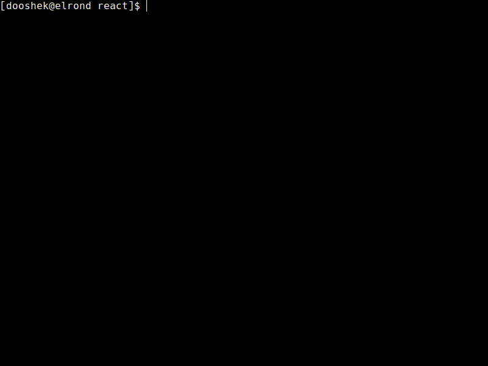

 

**Table of Contents**
<!-- TOC depthfrom:1 -->

- [What's DeKick?](#whats-dekick)
  - [What is our goal?](#what-is-our-goal)
  - [Common problems DeKick can help with:](#common-problems-dekick-can-help-with)
  - [How DeKick helps your team?](#how-dekick-helps-your-team)
  - [System requirements](#system-requirements)
- [How it works?](#how-it-works)
- [Quick start](#quick-start)
- [Usage](#usage)
  - [Running DeKick in **local** environment](#running-dekick-in-local-environment)
    - [Using `local` command](#using-local-command)
  - [DeKick commands](#dekick-commands)
    - [`e2e` command](#e2e-command)
  - [Global config (`~/.config/dekick/global.yml`)](#global-config-configdekickglobalyml)
  - [How to run flavour specific commands like `yarn`, `npm`, `npx`, `composer` or `artisan`?](#how-to-run-flavour-specific-commands-like-yarn-npm-npx-composer-or-artisan)
  - [How to run any command inside a container?](#how-to-run-any-command-inside-a-container)
- [Troubleshooting](#troubleshooting)
  - [Docker permission denied ("Got permission denied while trying to connect...")](#docker-permission-denied-got-permission-denied-while-trying-to-connect)
  - [Error response from deamon: network 45677... not found](#error-response-from-deamon-network-45677-not-found)
- [Contribution Guidelines](#contribution-guidelines)
  - [How to Contribute](#how-to-contribute)
  - [Code Standards](#code-standards)
  - [How to debug your code during development](#how-to-debug-your-code-during-development)
  - [How to test DeKick](#how-to-test-dekick)
  - [What are Boilerplates](#what-are-boilerplates)
  - [Issue Tracker](#issue-tracker)
  - [Communication](#communication)

<!-- /TOC -->
<!-- /TOC -->

# What's DeKick?
<a id="markdown-what's-dekick%3F" name="what's-dekick%3F"></a>
DeKick /də kɪk/ is a tool which supports and improves the work of dev team, by provisioning and building unified environments using [Docker](https://docker.com) without being an expert. It relieves the pain of running projects locally on different platforms (Linux, Windows with WSL2 or macOS with Intel and ARM based CPUs) and prevents many common problems faced by developers when dockerizing their projects.

DeKick goes even further and helps to build target Docker images which can be deployed on a test, beta or even production environment with ease.

Therefore, it helps to reduce the time spent on setting up and configuring development environments and enables developers to quickly switch between projects or work on multiple projects simultaneously without any compatibility issues.

## What is our goal?
<a id="markdown-what-is-our-goal%3F" name="what-is-our-goal%3F"></a>

Transform the way developers work, giving them the freedom to run apps, ignite their coding passion, and bring their projects to life with effortless fixes and deployments.

## Common problems DeKick can help with:
<a id="markdown-common-problems-dekick-can-help-with%3A" name="common-problems-dekick-can-help-with%3A"></a>

- Differences in local environments between members of the same team, cause many additional issues.
- What worked locally doesn't work in other environments e.g. test, beta or production.
- Using Docker and dockerizing software needs additional knowledge.
- The need for assistance when a new developer approaches the project for the first time.
- Revisiting a project from years past, eager to make a small adjustment, only to be met with the frustration of being unable to launch it.
- The burden of installing numerous required software, including the correct versions of Node and PHP, along with additional software, and the hassle of setting it all up.
- The inconsistency in platforms used by dev team members, e.g. one using macOS with Apple M1 processor and the other using a unique Linux distribution, creating difficulties in installing required software and intensifying platform differences.
- Hardware failures exclude a developer from work for a significant period.

## How DeKick helps your team?
<a id="markdown-how-dekick-helps-your-team%3F" name="how-dekick-helps-your-team%3F"></a>

DeKick can be the answer when ***"It (locally) works for me"*** is not enough ;) It:

- Maintains consistency between team members' local setups and target environments.
- Allows you to run a project on a computer that has almost nothing on it, runs in dockerized environment as well, so it requires only Docker to operate and making it easy and fast to start (in minutes).
- Allows people who are not proficient in Docker commands to take advantage of the dockerized project.
- Eases onboarding for new team members and reduces dependence on senior deveSimplifies switching between projects with varying environment requirements. Work on multiple projects or revisit old ones seamlessly, without the need for constant local environment adjustments.
- Uses built in boilerplates to create basic file structure needed to quickly start your project, at the same time bringing standardization.
- Starts local database and seeds it with pre-set data (as specified by the chosen flavour)
- Runs backend and frontend simultaneously, at the same device, even if using different versions of, e.g. Node.

## System requirements
<a id="markdown-system-requirements" name="system-requirements"></a>
- Linux, Windows (with [WSL2](https://learn.microsoft.com/en-us/windows/wsl/install)) or macOS (both Intel and ARM CPUs are supported)
- [Docker Engine](https://docs.docker.com/engine/install/ubuntu/) on Linux or [Docker Desktop](https://docs.docker.com/desktop/install/mac-install/) on macOS, Windows installed
- Terminal with `bash` or `zsh` shell (other shell like `fish` are not supported for now)

# How it works?
<a id="markdown-how-it-works%3F" name="how-it-works%3F"></a>
 - DeKick uses small script (`dekick-docker.sh`) to run [`desmart/dekick:develop`](https://hub.docker.com/r/desmart/dekick) image that has already installed Python with the proper version as well as Python's packages neccessary to run DeKick.
 - Projects `dekick/` directory is mounted inside this image so current project's DeKick version is used. This allows to have different DeKick versions in different projects. DeKick images won't be deleted after release of the current version from Docker Hub so you can use older versions of DeKick if you like. You can even modify your local (project's) DeKick to whatever suits you and this one would be used.

# Quick start
<a id="markdown-quick-start" name="quick-start"></a>

- clone DeKick to your project's `dekick/` directory
- in your terminal:
```shell
cd [YOUR_PROJECT_BASE_DIRECTORY]`
source dekick/dev
dekick install
```
(the `install` command is planned for future releases, soon :slightly_smiling_face:)
- answer some questions about the **project**, **flavour**, **boilerplate** etc.
- some new files should appear in your project (i.e. `.dekickrc.yml`, `docker-compose.yml`, `.gitlab-ci.yml`, depdends on the flavour and boilerplate you've chosen)
- run
```shell
cd [YOUR_PROJECT_BASE_DIRECTORY]
source dekick/dev
dekick local
```
- commit everything

# Usage
<a id="markdown-usage" name="usage"></a>

## Running DeKick in **local** environment
<a id="markdown-running-dekick-in-**local**-environment" name="running-dekick-in-**local**-environment"></a>
A **local** environment is this one that's run on developer's machine. One uses local version mostly for **development** of the application, so the tool provides an environment that closely mimics the production environment, allowing developers to test and debug their code under realistic conditions.

### Using `local` command
<a id="markdown-using-local-command" name="using-local-command"></a>
Assuming that you already have DeKick installed run following commands to start local environment:
```shell
cd [YOUR_PROJECT_BASE_DIRECTORY]
```

And then, when you are inside your project's base directory run:
```shell
source dekick/dev
```

This will make available `dekick` command which will allow you to use it wherever you will change directory to (current terminal session only! If you want to open another terminal then you would have to run `source dekick/dev` again)

Start local environment:
```shell
dekick local
```



DeKick will start the development enviromnent which depends on specific flavour. Typically, depending on the project size, project is ready to be developed in a matter of a couple of minutes (sometimes even under a minute).

## DeKick commands
<a id="markdown-dekick-commands" name="dekick-commands"></a>

### `e2e` command
<a id="markdown-e2e-command" name="e2e-command"></a>
This command is used to run end-to-end tests using popular Cypress image (right now, it's our [own Docker image based on Cypress included](https://hub.docker.com/r/desmart/cypress-included/tags) version). It runs `cypress` tests inside a container.

> For now, we support opening Cypress GUI and running tests on **Linux** and **macOS** only.

You need to have `cypress/` directory with all the tests and typical Cypress directory structure inside your project. You can read more about Cypress [here](https://www.cypress.io/).

Also, there's a special `cypress/cypress.config.template.js` file which is, when starting the container copied to `cypress/cypress.config.js` file. You can use it to configure your Cypress tests and inject environment variables to them. Just add needed variables to `.env` file in the root of your project and they will be available in `cypress/cypress.config.js` file after starting the container.

For example file `cypress/cypress.config.template.js` can look like this:

```javascript
const { defineConfig } = require('cypress')

module.exports = defineConfig({
  env: {
    LOGIN_EMAIL: '${CYPRESS_LOGIN_EMAIL}',
    LOGIN_PASSWORD: '${CYPRESS_LOGIN_PASSWORD}',
  },
  e2e: {
    baseUrl: '${CYPRESS_BASE_URL}',
    testIsolation: false,
    chromeWebSecurity: false,
  }
})
```

and `.env` file can look like this:

```shell
CYPRESS_LOGIN_EMAIL=someuser@some-url.com
CYPRESS_LOGIN_PASSWORD=some-very-long-password
CYPRESS_BASE_URL=https://some-url.com
```


To run tests in **headless** mode (without opening Cypress GUI) run:
```shell
dekick e2e
```

this is equivalent to:
```shell
dekick e2e --mode run
```

To open Cypress GUI and run tests in **interactive** mode run:
```shell
dekick e2e --mode open
```

If you need to run (in headless mode) only specific test file then run:

```shell
dekick e2e --mode run --spec cypress/e2e/your-test.cy.js
```

> Note that `--mode` option is optional, if you don't provide it then `run` mode will be used by default.

> Running tests on macOS will require to install `xquartz` package. You can install it using `brew install xquartz` command or by downloading it from [here](https://www.xquartz.org/).

## Global config (`~/.config/dekick/global.yml`)
<a id="markdown-global-config-~%2F.config%2Fdekick%2Fglobal.yml" name="global-config-~%2F.config%2Fdekick%2Fglobal.yml"></a>
You can create global config file in your home directory in `.config/dekick/global.yml` file. This file will be used as a default config for all projects. The structure is following:

```yaml
boilerplates:
  git_url: [string, default: "" - URL to git repository with boilerplates]
gitlab:
  token: [string, default: "" - Gitlab token with API access, needed for getting .env file from Gitlab]
dekick:
  local:
    disable_seed_ask: [boolean, default: false - if true then running `dekick local` will ommit the question about seeding database]
```
If the file doesn't exist then DeKick will use default values.

## How to run flavour specific commands like `yarn`, `npm`, `npx`, `composer` or `artisan`?
<a id="markdown-how-to-run-flavour-specific-commands-like-yarn%2C-npm%2C-npx%2C-composer-or-artisan%3F" name="how-to-run-flavour-specific-commands-like-yarn%2C-npm%2C-npx%2C-composer-or-artisan%3F"></a>
Hence DeKick is dockerized (runs inside a Docker container), in order to run commands like `yarn` (for **react** flavour) or `composer` (for **laravel** flavour) you have to run it using `dekick` command. For example if you want to add `lodash` package using `yarn` then just run:

```shell
dekick yarn add lodash
```
This will run `yarn` inside a proper container which your application is build with.


> Note that above will only work with some flavours like `react`, running `dekick yarn` command on `laravel` flavour won't work because there is no `yarn` command inside a node image.

## How to run any command inside a container?
<a id="markdown-how-to-run-any-command-inside-a-container%3F" name="how-to-run-any-command-inside-a-container%3F"></a>
DeKick runs in a container and you can run any command inside it. For example, if you want to run `ls` command inside a container then just run:

```shell
dekick ls -l
```

> Note that this is DeKick's own container, not the one with your application. If you want to run a shell inside a container with your application then run `dekick shell` command.

This will run `ls -l` inside a proper container which your application is build with. By default it will run `ls` in the project directory which is bind mounted inside the container in the same directory as your project. When you run `source dekick/dev` you'll "lock" your project root path which will be the project you are in during `source dekick/dev`.

**Note:** DeKick's using image based on [`docker:xx.xx.xx-cli-alpine`](https://hub.docker.com/_/docker) image which is based on Alpine Linux so you can use any command that is available in Alpine Linux.

# Troubleshooting
<a id="markdown-troubleshooting" name="troubleshooting"></a>

## Docker permission denied ("Got permission denied while trying to connect...")
<a id="markdown-docker-permission-denied-%22got-permission-denied-while-trying-to-connect...%22" name="docker-permission-denied-%22got-permission-denied-while-trying-to-connect...%22"></a>

If you get an error similar to this:
```
docker: Got permission denied while trying to connect to the Docker daemon socket at unix:///var/run/docker.sock: Post http://%2Fvar%2Frun%2Fdocker.sock/v1.35/containers/create: dial unix /var/run/docker.sock: connect: permission denied. See 'docker run --help'.
```

It means that `docker` daemon does not have correct permissions to run. DeKick expects that you are [managing docker as a non-root user](https://docs.docker.com/engine/install/linux-postinstall/) by adding it to the `docker` unix group. To create the docker group and add your user:

```shell
# Create the docker group.
sudo groupadd docker
# Add your user to the docker group.
sudo usermod -aG docker $USER
```

Please refer to [post-installation steps](https://docs.docker.com/engine/install/linux-postinstall/) and [troubleshooting](https://docs.docker.com/engine/install/troubleshoot/) sections of the Docker documentation for more details.

## Error response from deamon: network 45677... not found
<a id="markdown-error-response-from-deamon%3A-network-45677...-not-found" name="error-response-from-deamon%3A-network-45677...-not-found"></a>
This error can occur when trying to start a container that is configured to use a non-existent network.
To resolve this issue, you can try the following steps:
1. Check the name of the network you are trying to use. Make sure you have spelled the name correctly and that the network exists. You can check the list of available networks on your system by running the command:
```shell
docker network ls
```
2. If the network does not exist, you can create it using the following command:
```shell
docker network create {NETWORK_NAME}
```
Replace `{NETWORK_NAME}` with the name you want to give to the network.

However, this error can also be caused by issues with running containers or volumes as well. In this case, you may need to shut down all containers or remove unused volumes to resolve the issue. Additionally you may also restart Docker.

To shut down all running containers you can use:
```shell
docker ps -q  | xargs docker kill
```

To remove unused volumes you can use:
```shell
docker system prune -a --volume
```
It is important to note that this command will remove all unused resources, so make sure that you don't have any important data stored in the volumes that you are removing.

To restart docker you need to use one of the follow instruction:

on macOS, Windows you can just restart **Docker Desktop** application

on Linux:
```shell
sudo systemctl restart docker
```


If you encounter an error and there is no specific information available, you should check the Docker container logs using the following command:
```shell
docker logs {CONTAINER_ID} -f
```
Replace `{CONTAINER_ID}` with the `ID` of the specific container you are interested in. This command will display the logs for the container, which may contain helpful information for troubleshooting the issue.


# Contribution Guidelines
<a id="markdown-contribution-guidelines" name="contribution-guidelines"></a>
Thank you for your interest in contributing to DeKick! We welcome contributions from anyone, whether you are a seasoned developer or just starting out.

## How to Contribute
<a id="markdown-how-to-contribute" name="how-to-contribute"></a>
1. Fork the repository to your own GitHub account.
2. Clone the project to your local machine.
3. Create a new branch with a descriptive name for your feature or bug fix.
4. Make changes to the code, documentation, or tests.
5. Test and [debug](#how-to-debug-your-code-during-development) your changes thoroughly to ensure they work as expected.
6. Commit your changes and push them to your fork.
7. Open a pull request in our repository and provide a brief description of the changes you have made.
8. Wait for feedback or approval from the project maintainers.
9.  If the reviewing maintainer suggests any modifications to your pull request, then proceed to make those changes.
10. Once your pull request has been merged, take the time to celebrate your accomplishment!

## Code Standards
<a id="markdown-code-standards" name="code-standards"></a>
When contributing code to DeKick, please adhere to the following guidelines:

- Use clear and descriptive variable names.
- Write concise and well-documented code.
- Use consistent formatting and adhere to the project's existing style.
- Write tests for any new functionality you add.
- Remember to [run tests](#how-to-test-dekick) regularly and to ensure that all tests pass before submitting a pull request. This will help ensure that the code is stable and meets the project's requirements.


## How to debug your code during development
<a id="markdown-how-to-debug-your-code-during-development" name="how-to-debug-your-code-during-development"></a>
Debugging DeKick can be done using an independent version of the tool. This is because using an independent version makes it easier to pinpoint the source of the error and to ensure that the code being debugged is the correct version.

To start debugging, follow these steps:

1. Get an independent DeKick project repository that is not tied to a specific project on your local machine.
2. Navigate to the project repository in which you can test DeKick with your changes.
3. Run DeKick from the project repository using the command:
```shell
source ../../desmart-internal/dekick/dev
```
This command will ensure that you are running the independent version of DeKick and not the version installed in the project.

4. Set the debugger flag and run DeKick using the command:
```shell
DEKICK_DEBUGGER=true dekick local
```
This will launch DeKick in local mode and allow you to step through the code and debug any issues that may arise.

DeKick uses the debugger from VS Code, which allows you to set breakpoints and step through the code line by line. Configuration for debugger you can find in a `launch.json` file.

You can start the debugger by clicking on the `RUN AND DEBUG` button in the debug panel. This will start the DeKick application in debugging mode.

In order to set breakpoints in the code you need to click on the left-hand margin in VS Code. When the application reaches a breakpoint, it will pause execution and you can inspect the state of the code and step through it line by line to identify any issues.

Debugging is an important tool for identifying and fixing issues in your code, and using the VS Code debugger in DeKick makes it easy to do so.

## How to test DeKick
<a id="markdown-how-to-test-dekick" name="how-to-test-dekick"></a>
Testing DeKick is an important part of the development process, as it ensures that the code is functioning correctly and meets the project's requirements. In `DeKick` we use `pytest` with `xdist` plugin, that allows you to run tests in parallel across multiple CPUs or machines.

When you run `pytest` with `xdist` enabled, it will distribute the tests across multiple workers `(processes or threads)` and execute them simultaneously. The number of workers can be specified through the `-n` option. By default, `pytest-xdist` uses 2 threads for parallel test execution. One of the benefits of using xdist is that it can significantly reduce the execution time of test suites, especially for large projects with many tests.

Here's how to run tests on DeKick:

1. To run tests in `DeKick`, navigate to the repository directory on your local machine.
2. Set up your environment: Before running the tests, you will need to set up your environment. Make sure that you have a `.env` file that contains the necessary environment variables, including the `BOILERPLATES_GIT_URL` key which should contain the URL to the repository with the boilerplates connected.
3. Run all tests: To run all tests, use the command
```shell
dekick pytest
```
This command will run all tests in the repository and display the results.

1. Run specific tests: If you want to run a specific test, use the command
```shell
dekick pytest tests/{CHOSEN_TEST}
```
Replace `{CHOSEN_TEST}` with the name of the test file or test method that you want to run.

1. Analyze test results: After running the tests, analyze the results to ensure that all tests pass and that the code is functioning as expected.

## What are Boilerplates
<a id="markdown-what-are-boilerplates" name="what-are-boilerplates"></a>

Boilerplates are starter kit projects that are used to test DeKick and to provide a starting point for new projects. These boilerplates are pre-configured projects that are set up to work with specific frameworks and technologies, such as React, Express, or PHP with Laravel framework.

Currently, the boilerplates used in the DeKick project are stored in a private repository. However, we plan to make these boilerplates available to all users in the future.

When you run DeKick, it uses these boilerplates to create a new project or to provision a development environment. This makes it easy to get started with a new project and ensures that the project is set up correctly from the start with the specific framework or technology that you have chosen.

Once the boilerplates are made public, you will be able to access them from the DeKick repository and use them for your own projects.

## Issue Tracker
<a id="markdown-issue-tracker" name="issue-tracker"></a>
If you encounter any bugs or issues with DeKick, please report them using the project's issues. When reporting an issue, please provide as much detail as possible, including:

- A description of the problem you encountered.
- Steps to reproduce the issue.
- The version of DeKick you are using.
- Any relevant error messages or logs.


## Communication
<a id="markdown-communication" name="communication"></a>
If you have any questions or need help with your contribution, you can reach out to the project maintainers on our mailing list (dooshek@desmart.com).
We are happy to help and answer any questions you may have.

Thank you for your contributions and for helping to make DeKick better!

